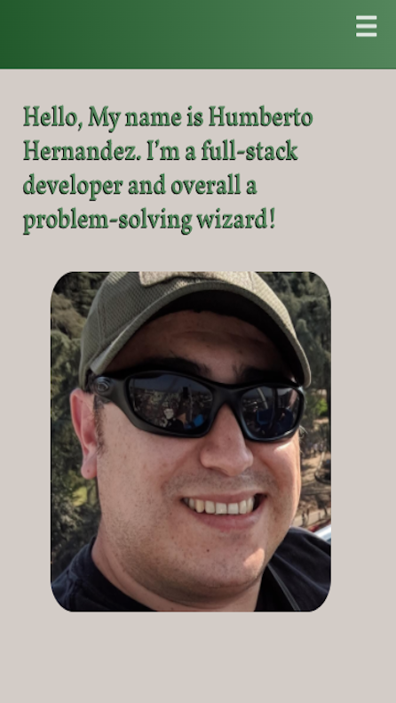
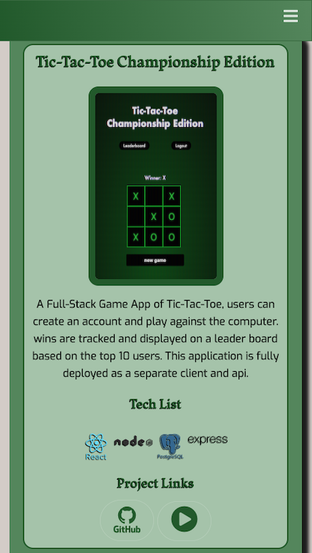
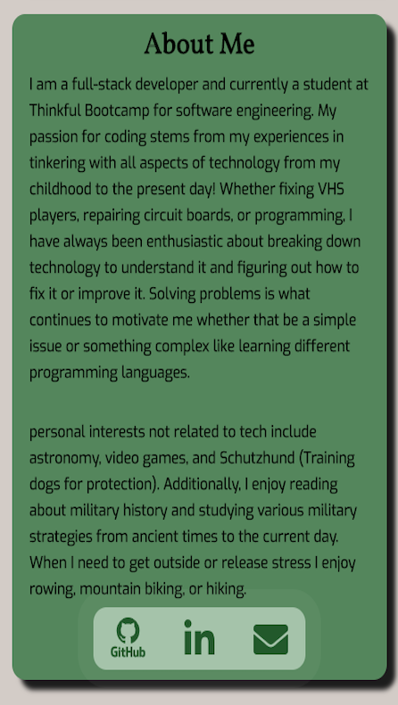

# Portfolio

> A responsive mobile first portfolio

## Live App link

- www.hernandez45.com

## App Images

  
  
  
  

## Summary

A responsive mobile first portfolio, built and styled utilizing pure HTML5 and CSS3, with minimum javascript. Headline section displays an introduction and a self image, The projects section showcases projects with a project image, description, technology stack and active links to a deployed version and respective repositories. An About me section displays my information and interest, featuring active links to Github and Linkedin accounts, additionally an email icon opens an email prompt.

## Technology Stack

### Front End

- HTML5
- CSS
- JavaScript
- jQuery

### Development Environment

- Git
- GitHub
- Visual Studio Code

## Contributors

This application was built by [Humberto Hernandez](https://github.com/WiFiCowboy),
